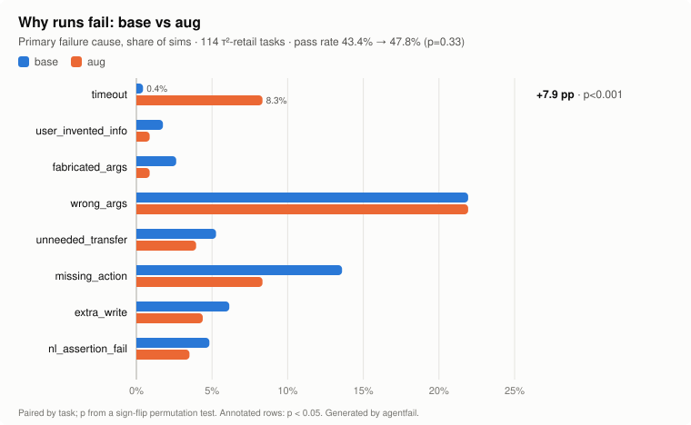

# agentfail

**Why did my agent fail, and did my change actually help?**

`agentfail` reads τ²-bench (τ-bench v2) result files, labels each failed simulation with a
root-cause category, and compares two runs task-by-task with significance tests. It has a
regression gate that exits non-zero, so you can drop it into CI after an eval run.

- Rule-based, deterministic, stdlib only: no LLM calls, no GPU, no dependencies.
- Every label comes with evidence (the tool call, the arg diff, the user turn).
- Paired statistics: per-task deltas, permutation p-values, bootstrap CIs, pass^k.

## Findings on real runs

Four τ²-retail runs (114 tasks each) of local models served through vLLM (`hosted_vllm/{base,aug,old,new}`).



| primary failure cause (share of sims) | fault | base | aug | Δ | p | old | new | Δ | p |
|---|---|---:|---:|---:|---:|---:|---:|---:|---:|
| timeout | agent | 0.4% | 8.3% | **+7.9pp** | **<0.001** | 0.0% | 0.9% | +0.9pp | 1.00 |
| user_invented_info | **user** | 1.8% | 0.9% | −0.9pp | 0.50 | 0.9% | 2.6% | +1.8pp | 0.50 |
| fabricated_args (in a write) | agent | 2.6% | 0.9% | −1.8pp | 0.29 | 2.6% | 2.6% | 0.0pp | 1.00 |
| wrong_args | agent | 21.9% | 21.9% | 0.0pp | 1.00 | 26.3% | 16.7% | −9.6pp | 0.07 |
| unneeded_transfer | agent | 5.3% | 3.9% | −1.3pp | 0.65 | 6.1% | 2.6% | −3.5pp | 0.34 |
| missing_action | agent | 13.6% | 8.3% | −5.3pp | 0.07 | 7.9% | 16.7% | +8.8pp | 0.05 |
| extra_write | agent | 6.1% | 4.4% | −1.8pp | 0.50 | 7.0% | 7.0% | 0.0pp | 1.00 |
| nl_assertion_fail | agent | 4.8% | 3.5% | −1.3pp | 0.63 | 2.6% | 2.6% | 0.0pp | 1.00 |
| **pass rate** | | 43.4% | 47.8% | +4.4pp | 0.33 | 46.5% | 48.2% | +1.8pp | 0.87 |
| **pass^2** | | 25.4% | 35.1% | | | n/a | n/a | | |

base/aug: 2 trials per task (228 sims); old/new: 1 trial (114 sims). The customer is simulated
by `gpt-4.1` at temperature 0 in all four runs.

What this says:

1. **Neither headline gain is real yet.** +4.4pp (95% CI −3.5..+11.8) and +1.8pp (CI −8.8..+12.3)
   are well inside the noise at 114 tasks. Behind the small net changes there's a lot of
   churn: 18 tasks fixed vs 19 broken for aug, 19 vs 17 for new.
2. **aug's only significant change is a regression:** timeouts go from 1 to 19 of 228 sims.
   Its drop in missing actions (−5.3pp, p=0.07) is suggestive, not proven.
3. **wrong_args is the biggest bucket everywhere** (17–26% of sims): the agent calls the right
   tool on the wrong order/items, e.g. `exchange_delivered_order_items: new_item_ids:
   ['5320792178'] != ['1569765161']`.
4. **Unneeded hand-offs.** In 34 of base's 129 failures the agent transferred the customer to a
   human when the task expected it to finish the job. In 12 of those that's the main cause (the
   required writes never happened).
5. **The simulated customer causes only a few failures: 1–3% per run** (agent 125 vs user 4 for
   base). Each one is the customer inventing a zip code or address that isn't in its script, e.g.
   saying `94109` when its script only gives emails, which then blocks the account lookup. Some of
   these are shared blame: in task 35 a second scripted email would have worked if the agent
   had asked for it.
6. **Placeholder probing.** All runs sometimes call tools with invented values before asking the
   user (`find_user_id_by_name_zip(John, Doe, 12345)`, `user@example.com`), including in runs that
   pass. It's a primary cause only when the invented value reaches a write, e.g.
   `modify_user_address.address1='123 Main St'`.

## Install

```bash
pip install .          # or run in place: python3 -m agentfail ...
```

## Usage

```bash
# label failures in one run
agentfail classify results.json --examples 2 --jsonl findings.jsonl

# compare two runs; exits 1 if the candidate regresses
agentfail compare base.json candidate.json \
    --max-drop 0.02 --max-increase timeout=0.02 --alpha 0.05 --json report.json
```

- `--max-drop 0.02`: tolerate up to a 2pp pass-rate drop
- `--max-increase CAT=RATE`: also fail if a category's share of sims rises more than RATE (repeatable)
- `--alpha 0.05`: a regression must also be significant (`--alpha 1` ignores p)
- `--json`: full comparison + gate verdict for CI artifacts

`classify` output (base run):

```
tau3std_base_results.json  model=hosted_vllm/base  sims=228  pass=99 (43.4%)
failures by fault: agent 125, user 4 (simulated by gpt-4.1)

category             primary  any(fail)  any(pass)
timeout                    1          1          0
user_invented_info         4          6          1
fabricated_args            6         24         11
wrong_args                50         56          0
unneeded_transfer         12         34          2
missing_action            31         61          1
...
```

`primary` = root cause of a failed sim; `any(fail)` / `any(pass)` = how often the label shows up
as evidence in failed / passed sims. A label that's common in passing sims isn't a root cause.

## Failure categories

Each failed sim gets exactly one **primary** label, the first that applies in this order:

| category | rule |
|---|---|
| `timeout` | `termination_reason` is `timeout` / `max_steps` / `too_many_errors` |
| `user_invented_info` | **user fault**: the customer states an order id / zip / email / user id that isn't in its script and wasn't said before, and the agent acted on it (it got written, or it blocked authentication) |
| `fabricated_args` | a **write** call uses an arg value never seen in any earlier user/tool message |
| `wrong_args` | an expected write was called with the right tool but different args |
| `unneeded_transfer` | the agent transferred to a human (the customer's `###TRANSFER###` ending) although the task didn't expect it, and expected writes are missing |
| `missing_action` | an expected write was never called |
| `extra_write` | a successful write that isn't in the expected set |
| `premature_action` | a write before the user was authenticated (`find_user_id_by_*` succeeded) |
| `db_mismatch_only` | all expected writes matched, but the final DB still differs |
| `nl_assertion_fail` | DB matched, but a required statement to the user (NL / communicate check) failed |

Every failure also gets a **fault**: `user` for `user_invented_info`, otherwise `agent`;
`classify` prints the split. Customer behaviors that were tested and dropped as unreliable: hanging up
right after an agent question (as common in passes as in failures, since scripts often say to
stop) and talking like the agent (one hit in 684 sims, a false positive).

Recorded as evidence only, never primary: `fabricated_args` in a *read* call,
`user_invented_info` the agent recovered from, `unneeded_transfer` after all writes were done, and
`unconfirmed_write` (no "yes" from the user right before a write; it shows up in 31–49% of
passing sims, so it can't explain failures).

Matching details: lists are compared as multisets, `compare_args` is honored, and expected
writes match even if the call errored, since τ² gold trajectories include calls that fail in
the environment.

## Statistics

Everything is **paired by task**: each task contributes its mean over trials, so runs with
different trial counts compare fine. Tasks present in only one run are ignored and reported.

- **pass^k**: τ-bench estimator, mean over tasks of C(successes, k) / C(trials, k).
- **p-values**: two-sided sign-flip permutation test on per-task differences (exact up to 16
  non-zero differences, otherwise 10,000 Monte Carlo draws with a fixed seed).
- **CI**: 95% percentile bootstrap over tasks for the pass-rate delta.
- **Gate**: fails when a change exceeds its tolerance **and** p < alpha, so noise alone doesn't
  block a merge.

## CI

`.github/workflows/ci.yml` runs the unit tests on Python 3.10–3.13 and an end-to-end gate check
on the small synthetic fixtures in `tests/fixtures/`. To gate your own eval pipeline:

```yaml
- run: pip install agentfail/
- run: agentfail compare baseline_results.json new_results.json --max-drop 0.02 --json gate.json
```

## Development

```bash
python3 -m unittest discover -s tests          # 34 tests, stdlib only
python3 scripts/make_chart.py BASE.json CAND.json docs/failures.svg --base-name base --cand-name aug
```

## Limitations

- τ²-bench result JSON only. τ-bench v1 JSONL transcripts have no inline ground truth and
  aren't supported yet.
- Rules were tuned on the retail domain (auth tools, write-tool prefixes).
- `fabricated_args` is substring-based: a value the user said in a different format
  (e.g. a spelled-out number) can be a false positive.
- At 114 tasks the noise is wide (pass-rate CIs span ~15–20pp); only the ~8pp category shifts
  above reached significance. More tasks or trials tighten it.
